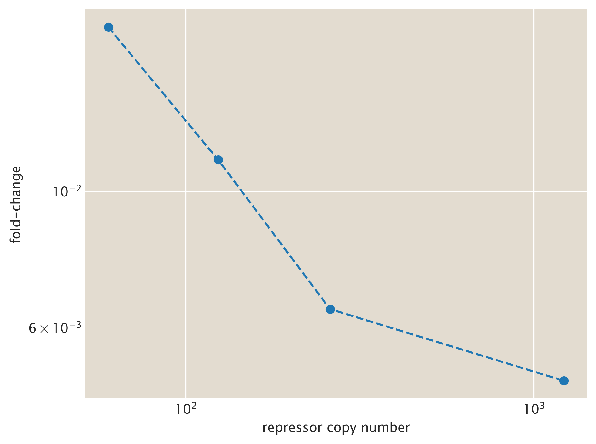

# 2018-04-12 Q21M DNA RBS  titration

## Purpose
This experiment measured the leakiness of DNA binding mutant Q21M over a range of repressor copy numbers using microscopy.

## Strain Information

| Location | Plasmid | Genotype | Host Strain | Shorthand | Class |
| :------- | :------ | :------- | ----------: | --------: | -----:| 
| `Manuel 01 - F2` | `pZS4*5-mCherry` |  `galK<>KD4Kan` | `HG104` | `auto` | `auto`|
| `Manuel 01 - F4` | `pZS4*5-mCherry` | `galK<>KD4Kan ΔlacIZYA` | `HG105` | `delta`| `delta`|
| `Manuel 02 - E2` | `pZS4*5-mCherry` | `ybcN<>3*1-RBS1027-LacI, galK<>25-O2+11-YFP` | `HG105` | `wt` | `WT`|
| `Manuel 04 - G9` | `pZS4*5-mCherry` | `galK<>25-O2+11-YFP, ybcN<>3*1-RBS1147_LacI_Q21M` | `HG105` | `Q21M_R60` | `DNA`|
| `Manuel 04 - G8` | `pZS4*5-mCherry` | `galK<>25-O2+11-YFP, ybcN<>3*1-RBS446_LacI_Q21M` | `HG105` | `Q21M_R124` | `DNA`|
| `Manuel 03 - D5` | `pZS4*5-mCherry` | `galK<>25-O2+11-YFP, ybcN<>3*1-RBS1027_LacI_Q21M` | `HG105` | `Q21M_R260` | `DNA`|
| `Manuel 04 - G7` | `pZS4*5-mCherry` | `galK<>25-O2+11-YFP, ybcN<>3*1-RBS1_LacI_Q21M` | `HG105` | `Q21M_R1220` | `DNA`|

## Titration Series
| Inducer | Concentration |
| :------ | ------------: |
| Isopropylthiogalactopyranoside (IPTG) | 0 [mM] |

## Analysis Files

**Repressor Titration**

## Experimental Protocol

### Cell Husbandry

1. Cells as described in "Strain Information" were grown to saturation overnight in 1mL of LB Miller + spectinomycin in a 2mL-deep 96 well plate.

2. A 96 well plate with 495µL of M9 + 0.5% glucose  was prepared diluted with the appropriate amount of water to match the addition of IPTG in flow cytometry experiments.

3. Cells were diluted 1:10 into 1mL of fresh LB and thoroughly mixed. This was further diluted 1:100 into the M9 IPTG medium.

4. The 96 well plate was placed in the 37°C incubation room and allowed to grow for 8 hours shaking at 225 RPM. This time is sufficient for cells to reach an  OD600nmof approximately 0.3

5.  Once 8 hours had passed, the cells were diluted 1:10 in to the chilled shallow 96 well plate filled with media and the appropriate concentration of IPTG. This plate was then used for microscopy.

### Microscopy

1. Molten M9 + 0.5% glucose and 2% agarose was sandwiched in between two glass slides and allowed to solidify. 

2. Once solidified, approximately 0.5 cm2 squares were cut with a razor blade. Aliquots of 1µL of the diluted cell mixture were added to the appropriate pads and allowed to dry for several minutes. 

3. Pads were organized onto a UV sterilized glass-bottomed dish and sealed with parafilm.

4. Pads were imaged on a Nikon Ti Eclipse microscope outfitted with custom laser illumination for mCherry and YFP. Between 5 and 10 positions were marked per pad and images were acquired automatically. 

5. Images of a homogeneously fluorescent slide were taken as well as images of the camera shot noise for flattening. 

6. Once completed, images were transferred to the backup server. 
